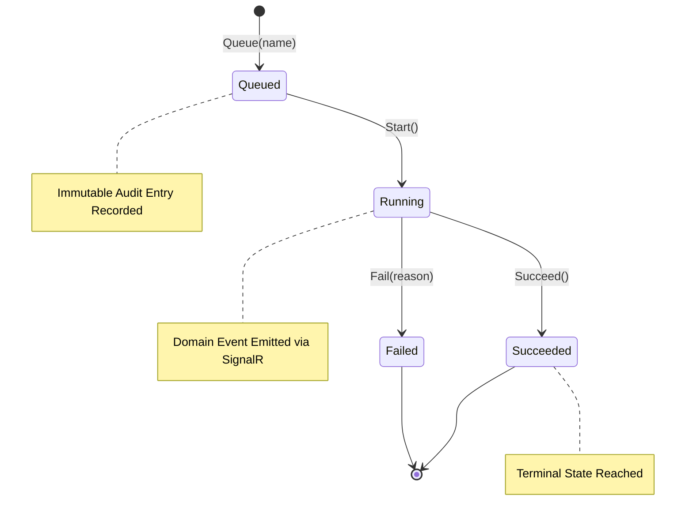
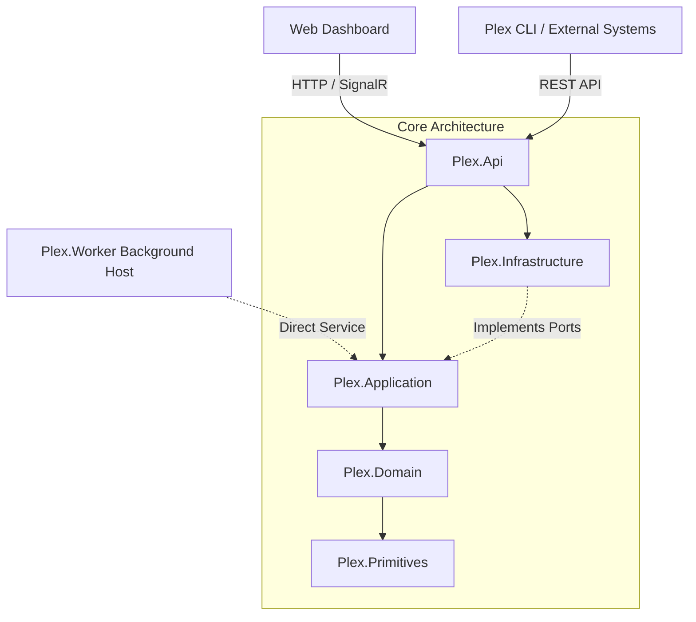

# Plex

<div align="center">


### **Distributed Operations & Audit Platform**
*A production-grade, event-driven reference architecture for long-running workflows with guaranteed audit trails.*

**Engineered by Musa Divarcı** — .NET / C# Backend & Distributed Systems Specialist

[Live Dashboard](#interactive-web-dashboard) • [Architecture](#architecture) • [Domain Events](#domain-events--state-machine) • [Quickstart](#quickstart) • [Author](#author)

---

</div>

## Overview

**Plex** is an architecture-focused backend platform engineered to coordinate distributed operational workloads while preserving an immutable, queryable audit trail of every state transition. 

Rather than a conventional CRUD demo, Plex serves as a production-grade blueprint illustrating **Clean Architecture (Hexagonal / Ports & Adapters)**, **Domain-Driven Design (DDD)**, **Domain Event Dispatching**, and **Real-Time WebSockets via SignalR**.



---

## Key Highlights

- **.NET 10 LTS & C# 14:** Modern language features including primary constructors, collection expressions, pattern matching, and file-scoped namespaces.
- **Clean Dependency Boundaries:** Business logic has zero external dependencies; frameworks remain strictly at the periphery.
- **Guarded Domain State Machine:** Explicit aggregate invariants preventing invalid operational state transitions.
- **Domain Event Dispatching:** First-class domain events (`OperationQueuedDomainEvent`, `OperationStartedDomainEvent`, `OperationSucceededDomainEvent`, `OperationFailedDomainEvent`) dispatched upon persistence.
- **Real-Time SignalR WebSockets:** Connected clients receive instant updates as operations transition through execution phases.
- **Interactive Live Dashboard:** Built-in dark glassmorphism web console at `/` with zero external dependencies to queue, trigger, and inspect operations in real-time.
- **Worker Service Integration:** Independent background processing host for distributed worker workloads.
- **Docker Compose Orchestration:** Single-command multi-container execution for API and Worker services.

---

## Interactive Web Dashboard

Plex includes an embedded real-time operational dashboard accessible directly at `http://localhost:5000/`.

- **Live Real-time Feed:** Powered by SignalR WebSockets for zero-latency status broadcasts.
- **One-Click Operations:** Fast-trigger operational jobs with built-in presets (Ledger Rebuild, Cache Sync, Bank Reconciliation).
- **Audit Trail Inspector:** Deep-dive timeline view showing exact timestamp, event type, and message payloads for any selected operation.
- **Live KPIs:** Real-time metrics tracking total jobs, active workers, success rates, and failure counts.

---

## Architecture



### Dependency Rules

| Layer | Responsibility | Dependencies |
|---|---|---|
| **`Plex.Primitives`** | Lightweight, dependency-free `Result<T>`, `Error`, and `Guard` structures. | None |
| **`Plex.Domain`** | Pure C# business invariants, aggregate root (`Operation`), and `IDomainEvent` definitions. | `Plex.Primitives` |
| **`Plex.Application`** | Use cases (`OperationService`), store ports (`IOperationStore`), and event publisher contracts (`IOperationEventPublisher`). | `Plex.Domain` |
| **`Plex.Infrastructure`** | Concrete storage adapters (In-Memory, EF Core / Postgres ready). | `Plex.Application` |
| **`Plex.Api`** | ASP.NET Core Minimal APIs, SignalR Hubs (`OperationsHub`), and Embedded Dashboard. | `Plex.Application`, `Plex.Infrastructure` |
| **`Plex.Worker`** | Background service host for distributed asynchronous workload processing. | `Plex.Application`, `Plex.Infrastructure` |

---

## Quickstart

### Option 1: Run Locally (.NET 10 SDK)

```bash
# Clone the repository
git clone https://github.com/musadivarci/PlexV1.git
cd PlexV1

# Run the test suite
dotnet test

# Launch the API & Web Dashboard
dotnet run --project src/Plex.Api
```

Open your browser and navigate to:
👉 **`http://localhost:5000`** (or configured port) to access the Live Operations Dashboard.

### Option 2: Docker Compose

```bash
docker compose up --build
```

---

## REST API Specification

```http
# 1. Queue a new operational task
POST /api/operations
Content-Type: application/json
{
  "name": "nightly-ledger-rebuild"
}

# 2. Transition operation to Running
POST /api/operations/{id}/start

# 3. Complete successfully
POST /api/operations/{id}/succeed

# 4. Or fail with reason
POST /api/operations/{id}/fail
Content-Type: application/json
{
  "reason": "Database connection timeout during batch sync"
}

# 5. Fetch full state with immutable audit trail
GET /api/operations/{id}
```

---

## Author

<div align="center">

**Musa Divarcı**  
*Creator & Lead Engineer · Management Information Systems (MIS)*  

[](https://www.musadivarci.com.tr/)
[](https://github.com/musadivarci)
[](https://www.linkedin.com/in/musa-divarci-9280515a)

Specializing in **C# / .NET 10**, **Distributed Systems**, **Clean Architecture**, **Enterprise Integration**, and **Modern Full-Stack Applications**.

</div>

---

<div align="center">
<sub>"Good backend architecture is less about frameworks and more about preserving boundaries as systems grow."</sub>
</div>

